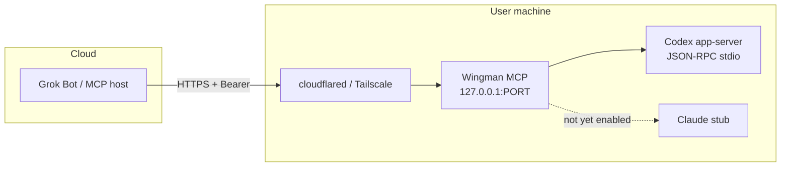

# Wingman

**Your coding agent's wingman** — a TypeScript MCP bridge + pair CLI so Grok Bot (and other MCP hosts) can talk to live Codex sessions on your machine while you still see the session.

Codex-first. Claude is stubbed until a stable session API lands.

[](LICENSE)
[](tsconfig.json)

---

## Why Wingman?

Cloud assistants are great copilots — until they need to *touch* the session you're already in. Wingman sits on your machine, pairs with a one-command CLI, and exposes a small MCP surface so a remote host can list threads, read transcripts, send messages, and interrupt turns — without hijacking your TTY or pretending to be the Codex UI.

Think of it as a radio link between the bot in the cloud and the agent on your desk. You're still flying; Wingman just rides shotgun.

## Quickstart (3 steps)

```bash
git clone https://github.com/juangurdian/wingman.git
cd wingman
npm install
CODEX_MOCK=1 npm run pair
```

1. **Pair** — `CODEX_MOCK=1 npm run pair` generates a bearer token, writes `~/.wingman/config.json`, and starts MCP on `127.0.0.1:3847/mcp`.
2. **Tunnel** — remote hosts cannot reach localhost. Expose the port:

   ```bash
   # Cloudflare quick tunnel
   cloudflared tunnel --url http://127.0.0.1:3847

   # or Tailscale Funnel
   tailscale funnel 3847
   ```

3. **Add MCP server** (Grok Bot / Cursor `AddMcpServer`):

   | Field | Value |
   |-------|--------|
   | **name** | `wingman` |
   | **url** | `https://YOUR-TUNNEL-HOST/mcp` |
   | **Authorization** | `Bearer <token printed by pair>` |

Then ask the host to call `list_sessions` → `read_transcript` / `send_message` / `interrupt`.

### Real Codex mode

Requires `codex` on `PATH`. Wingman speaks **Codex app-server** JSON-RPC (`codex app-server` over stdio) — **not** the removed `codex mcp-server`.

```bash
npm run pair   # unset CODEX_MOCK
```

Docs: [Codex App Server](https://learn.chatgpt.com/docs/app-server) · [app-server README](https://github.com/openai/codex/blob/main/codex-rs/app-server/README.md)

## Can / Can't

**Can**

- Pair in **mock mode** with no Codex install (`CODEX_MOCK=1`)
- Bridge Grok Bot ↔ local Codex threads via app-server once tunneled
- Bearer-protect the MCP HTTP endpoint
- Create / list / read / message / interrupt Codex sessions (real or mock)
- Keep you in the loop — the session stays visible on your machine

**Can't (yet)**

- Reach the bridge from a remote host without a **tunnel** (binds loopback only)
- Drive full Claude Code session UX (stub / optional `claude -p` oneshot)
- Auto-approve Codex sandbox prompts (approvals still belong to the local Codex client)
- Use legacy `codex mcp-server` (removed / not used here)

## Architecture



## MCP tools

| Tool | Args | Notes |
|------|------|--------|
| `list_sessions` | `provider?`: `codex` \| `claude` | Lists sessions (Claude stub marker if disabled) |
| `read_transcript` | `provider`, `session_id`, `limit?` | Recent messages |
| `send_message` | `provider`, `session_id`, `text` | Codex: `turn/start` |
| `interrupt` | `provider`, `session_id` | Codex: `turn/interrupt` (needs known turn id) |
| `create_session` | `provider`, `cwd?`, `prompt?` | Optional; Codex: `thread/start` |

## Scripts

| Script | Purpose |
|--------|---------|
| `npm run pair` | Generate token, save config, start MCP, print pair instructions (`wingman-pair` bin) |
| `npm run dev` | Start MCP only (needs existing config/token) |
| `npm run build` | Compile TypeScript → `dist/` |
| `npm test` | Vitest unit tests (mocked providers) |

## Config

`~/.wingman/config.json` (new installs). If you still have a legacy `~/.session-bridge/config.json`, Wingman will read it as a fallback.

```json
{
  "token": "...",
  "host": "127.0.0.1",
  "port": 3847,
  "mcpPath": "/mcp",
  "createdAt": "...",
  "mock": true
}
```

Env overrides (preferred → legacy alias):

| Preferred | Legacy alias |
|-----------|--------------|
| `WINGMAN_TOKEN` | `SESSION_BRIDGE_TOKEN` |
| `WINGMAN_PORT` | `SESSION_BRIDGE_PORT` |
| `WINGMAN_HOST` | `SESSION_BRIDGE_HOST` |

Also: `CODEX_MOCK`, `CODEX_BIN`, `CODEX_APP_SERVER_ARGS`.

## Agent skill

See [`skills/pair-coding-sessions/SKILL.md`](skills/pair-coding-sessions/SKILL.md) for setup / pair / operate steps aligned with this CLI.

## Community

Open-source. Early MVP — Codex path works (mock + app-server); Claude is stubbed; APIs may shift before 1.0.

Issues and PRs welcome — see [CONTRIBUTING.md](CONTRIBUTING.md). Ideas for tunnel helpers, Claude provider work, and other MCP-host guides are especially useful.

If Wingman helped you pair a session, star the repo or open an issue with what you tried. Good wingmen share the checklist.

## Develop

```bash
npm install
npm test
npm run build
CODEX_MOCK=1 npm run pair
```

Node 20+. Success criteria: install, test, and build succeed; mock pair prints URL + token.

## License

[MIT](LICENSE) © Juan Gurdian and contributors
