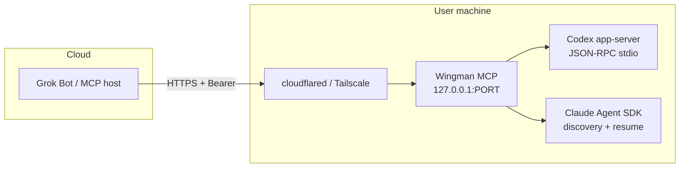

# Wingman

**Your coding agent's wingman** — a TypeScript MCP bridge + pair CLI so Grok Bot (and other MCP hosts) can talk to live Codex and Claude Code sessions on your machine while you still see the session.

Dual-provider: Codex (app-server) + Claude Code (Agent SDK).

[](https://github.com/juangurdian/wingman/actions/workflows/ci.yml)
[](https://www.npmjs.com/package/wingman-mcp)
[](LICENSE)
[](tsconfig.json)
[](https://nodejs.org/)

See **[ROADMAP.md](ROADMAP.md)** for positioning, backlog, and non-goals.

---

## Why Wingman?

Cloud assistants are great copilots — until they need to *touch* the session you're already in. Wingman sits on your machine, pairs with a one-command CLI, and exposes a small MCP surface so a remote host can list threads, read transcripts, send messages, and interrupt turns — without hijacking your TTY or pretending to be the agent UI.

Think of it as a radio link between the bot in the cloud and the agent on your desk. You're still flying; Wingman just rides shotgun.

## Quickstart

### Option 1: npx (recommended)

```bash
# Run directly without install — try it now!
npx wingman-mcp

# Or install globally for repeated use
npm install -g wingman-mcp
wingman-pair
```

Set `CODEX_MOCK=1` or `CLAUDE_MOCK=1` for mock mode (no real agent required).

### Option 2: Clone (for contributors)

```bash
git clone https://github.com/juangurdian/wingman.git
cd wingman
npm install
npm run pair
```

### After pairing

1. **Pair** — `wingman-pair` generates a bearer token, writes `~/.wingman/config.json`, and starts MCP on `127.0.0.1:3847/mcp`.
2. **Tunnel** — remote hosts cannot reach localhost. Pick a tunnel option (ranked by durability):

   ```bash
   # Option 1: Tailscale Serve (stable, loopback to your network)
   tailscale serve --bg 3847

   # Option 2: Tailscale Funnel (stable, public URL)
   tailscale funnel 3847

   # Option 3: Cloudflare named tunnel (stable, custom domain)
   # Run 'wingman-tunnel' for one-time setup instructions
   cloudflared tunnel run wingman

   # Option 4: Cloudflare quick tunnel (ephemeral, for demos)
   cloudflared tunnel --url http://127.0.0.1:3847
   ```

   For detailed setup help, run `wingman-tunnel` (or `npm run tunnel`).

3. **Add MCP server** (Grok Bot / Cursor `AddMcpServer`):

   | Field | Value |
   |-------|--------|
   | **name** | `wingman` |
   | **url** | `https://YOUR-TUNNEL-HOST/mcp` |
   | **Authorization** | `Bearer <token printed by pair>` |

Then ask the host to call `list_sessions` → `read_transcript` / `send_message` / `interrupt`.

### Real provider modes

**Codex** — Requires `codex` on `PATH`. Wingman speaks **Codex app-server** JSON-RPC (`codex app-server` over stdio).

```bash
npm run pair   # unset CODEX_MOCK
```

**Claude Code** — Uses the `@anthropic-ai/claude-agent-sdk`. Sessions are created and resumed through the SDK.

```bash
npm run pair   # unset CLAUDE_MOCK
```

Docs: [Codex App Server](https://learn.chatgpt.com/docs/app-server) · [Claude Agent SDK](https://code.claude.com/docs/en/agent-sdk/typescript)

## Can / Can't

**Can**

- Pair in **mock mode** with no agent install (`CODEX_MOCK=1` or `CLAUDE_MOCK=1`)
- Bridge Grok Bot ↔ local Codex threads via app-server once tunneled
- Bridge Grok Bot ↔ local Claude Code sessions via Agent SDK once tunneled
- **Discover existing Claude sessions** via SDK's `listSessions()` (sessions you created via `claude` CLI or Claude Code IDE)
- Resume discovered sessions by ID — the SDK reads session state from `~/.claude/projects/`
- Send messages to sessions asynchronously (returns `accepted` quickly; turn runs in background)
- Check session status (idle vs running) via `get_session` or `list_sessions`
- Bearer-protect the MCP HTTP endpoint
- Create / list / read / message / interrupt sessions (real or mock) for both providers
- Keep you in the loop — the session stays visible on your machine

**Can't (scope / v1 limits)**

- Reach the bridge from a remote host without a **tunnel** (binds loopback only)
- **Type into an open TTY** — SDK resume ≠ injecting keystrokes into a Claude/Codex terminal you're watching; Wingman calls SDK APIs that operate on session state files, not terminal processes
- Hijack arbitrary Claude / Codex TTYs you already have open elsewhere — Wingman manages sessions via SDK, not by attaching to interactive shells
- Interrupt a discovered session reliably unless Wingman started the current turn (no active query handle)
- Auto-approve sandbox prompts (approvals still belong to the local agent client)
- Use legacy `codex mcp-server` (removed / not used here)

## Architecture



## MCP tools

| Tool | Args | Notes |
|------|------|--------|
| `list_sessions` | `provider?`: `codex` \| `claude` | Lists sessions for one or both providers (includes `status`, `source`) |
| `get_session` | `provider`, `session_id` | Get detailed session info including status (`idle` / `running`) |
| `read_transcript` | `provider`, `session_id`, `limit?` | Recent messages (newest at end) |
| `send_message` | `provider`, `session_id`, `text` | Codex: `turn/start`; Claude: returns `accepted` quickly, turn runs async |
| `interrupt` | `provider`, `session_id` | Codex: `turn/interrupt`; Claude: works when Wingman owns the active turn |
| `create_session` | `provider`, `cwd?`, `prompt?` | Codex: `thread/start`; Claude: new session with optional initial prompt (async) |
| `wait_turn` | `provider: codex`, `session_id`, `timeout_ms?`, `poll_interval_ms?` | Wait for turn to complete/fail/timeout; returns status + message snippet |
| `steer` | `provider: codex`, `session_id`, `text` | Add guidance to in-flight turn via `turn/steer` |
| `list_approvals` | `provider: codex`, `session_id` | List pending sandbox/command approvals |
| `resolve_approval` | `provider: codex`, `session_id`, `approval_id`, `decision` | Resolve approval: `accept` \| `acceptForSession` \| `decline` \| `cancel` |

### create_session behavior

For **Claude sessions**, `create_session` returns immediately:
- **Without prompt**: Returns `{ sessionId, status: "created" }` — session is registered but no turn is running
- **With prompt**: Returns `{ sessionId, status: "accepted", turnId }` — the initial prompt turn runs in the background, preventing MCP HTTP timeouts

For **Codex sessions**, `create_session` calls `thread/start` and returns `{ sessionId, status: "created" | "accepted" }`.

### send_message behavior

For **Claude sessions**, `send_message` returns immediately with `{ status: "accepted", turnId }` while the SDK query runs in the background. Use `get_session` or `read_transcript` to observe progress. This prevents MCP HTTP timeouts during long model turns.

For **Codex sessions**, `send_message` blocks until `turn/start` returns (typically fast), then returns `{ status: "completed" | "inProgress" }`.

### interrupt behavior

For **Claude sessions**, `interrupt` works reliably when Wingman owns the active turn (i.e., you called `send_message` through Wingman for the current turn). Returns `{ status: "interrupted", turnId }` on success, or `{ status: "no_active_turn" }` if the session is idle.

**Limitation**: Interrupting discovered sessions or sessions where the turn was started outside Wingman (e.g., via Claude CLI directly) may not work — Wingman has no active query handle to abort. In these cases, use the Claude CLI directly: `Ctrl+C` in the terminal or `claude interrupt`.

For **Codex sessions**, `interrupt` requires a known active `turnId` tracked from `turn/started` notifications.

### Codex wait/steer/approvals (Codex-only)

These tools provide deeper integration with Codex app-server for long-running turns:

**wait_turn**: Long-poll instead of busy-polling `read_transcript`. Returns when the turn completes, fails, is interrupted, times out, or when approvals are pending. Example response:
```json
{ "sessionId": "thr_123", "turnId": "turn_456", "status": "completed", "latestMessage": "Done!" }
```

**steer**: Add mid-turn guidance without starting a new turn. Useful for follow-up instructions or clarifications while Codex is working. Uses Codex's `turn/steer` API.

**list_approvals** + **resolve_approval**: When Codex requires approval for sandbox commands, file changes, or network access, these tools let you surface and resolve those requests programmatically. Approvals are modeled as server-initiated JSON-RPC requests in the Codex protocol.

Example approval flow:
```
1. send_message("sudo apt update")  →  { status: "inProgress" }
2. list_approvals()                 →  { approvals: [{ id: "appr_1", kind: "command", command: "sudo apt update" }] }
3. resolve_approval("appr_1", "accept")  →  { resolved: true }
4. wait_turn()                      →  { status: "completed" }
```

**Note**: In mock mode (`CODEX_MOCK=1`), commands containing `sudo` or `rm -rf` trigger simulated approval requests for testing.

## Environment variables

### General

| Variable | Default | Description |
|----------|---------|-------------|
| `WINGMAN_TOKEN` | (generated) | Bearer token for MCP auth |
| `WINGMAN_PORT` | `3847` | MCP server port |
| `WINGMAN_HOST` | `127.0.0.1` | MCP server bind address |

### Codex

| Variable | Default | Description |
|----------|---------|-------------|
| `CODEX_MOCK` | unset | Set to `1` for in-memory mock mode |
| `CODEX_BIN` | `codex` | Path to Codex CLI binary |
| `CODEX_APP_SERVER_ARGS` | `app-server` | Args passed to Codex binary |
| `CODEX_RPC_TIMEOUT_MS` | `60000` | JSON-RPC timeout |

### Claude

| Variable | Default | Description |
|----------|---------|-------------|
| `CLAUDE_MOCK` | unset | Set to `1` for in-memory mock mode |
| `CLAUDE_DISCOVER` | `1` | Set to `0` to disable session discovery |
| `CLAUDE_DISCOVER_DIRS` | (all) | Colon-separated directories to search for sessions |

The Claude provider uses the bundled Agent SDK binary automatically. No separate `claude` CLI install is required unless you override `pathToClaudeCodeExecutable` in code.

## Session management

### Wingman-managed sessions

Wingman tracks sessions it creates in a local registry (`~/.wingman/claude-sessions.json` for Claude). This ensures:

1. **Isolation** — Only sessions started through Wingman's `create_session` are visible to MCP clients by default
2. **No TTY hijack** — We don't scan for or attach to Claude/Codex processes you started elsewhere
3. **Resumable** — Sessions can be resumed by ID across Wingman restarts

### Claude session discovery

Wingman can also **discover existing Claude Code sessions** via the Agent SDK's `listSessions()`. This allows `list_sessions` to find sessions the user created via `claude` CLI or Claude Code IDE — not only sessions created through Wingman.

**How discovery works:**
1. `list_sessions` merges Wingman's registry with sessions discovered via SDK
2. If the same session ID exists in both, the Wingman registry entry takes precedence
3. `read_transcript`, `send_message`, and `interrupt` work for discovered sessions by resuming via `query({ options: { resume: sessionId } })`
4. When you interact with a discovered session, it's auto-registered in Wingman's registry

**What discovery is NOT:** This is not TTY hijacking. Wingman does not attach to terminal processes, scrape windows, or take over interactive sessions. Discovery reads session files on disk via official SDK APIs.

Set `CLAUDE_DISCOVER=0` to disable discovery and only show Wingman-created sessions.

### SessionSummary fields

Sessions returned by `list_sessions` include:

| Field | Type | Description |
|-------|------|-------------|
| `source` | `'wingman' \| 'discovered'` | Origin of the session |
| `gitBranch` | `string?` | Git branch at end of session (discovered) |
| `tag` | `string?` | User-set session tag (discovered) |

### Claude session storage

Claude sessions are stored by the Agent SDK in `~/.claude/projects/<project-key>/<session-id>.jsonl`. Wingman's registry maps session IDs to their working directories so `listSessions()` and `readTranscript()` can locate them.

## Scripts & CLI

When installed globally (`npm i -g wingman-mcp`) or via npx:

| Command | Purpose |
|---------|---------|
| `wingman-pair` / `wingman-mcp` | Generate token, save config, start MCP, print pair instructions |
| `wingman-doctor` | Check environment: Node version, config, port, Claude SDK / Codex binary |
| `wingman-tunnel` | Detect tunnel tools, print ranked setup commands, persist tunnel state |

For local development:

| Script | Purpose |
|--------|---------|
| `npm run pair` | Same as `wingman-pair` (uses tsx) |
| `npm run doctor` | Same as `wingman-doctor` |
| `npm run tunnel` | Same as `wingman-tunnel` |
| `npm run dev` | Start MCP only (needs existing config/token) |
| `npm run build` | Compile TypeScript → `dist/` |
| `npm test` | Vitest unit tests (mocked providers) |

## Config

`~/.wingman/config.json` (new installs). If you still have a legacy `~/.session-bridge/config.json`, Wingman will read it as a fallback.

```json
{
  "token": "...",
  "host": "127.0.0.1",
  "port": 3847,
  "mcpPath": "/mcp",
  "createdAt": "...",
  "mock": true
}
```

## Doctor / Health Check

Run `npm run doctor` (or `wingman-pair --doctor`) to verify your environment:

```bash
npm run doctor
```

Checks:
- Node.js version (20+ required)
- Config file (`~/.wingman/config.json`)
- Port availability (3847 by default)
- Claude Agent SDK availability (unless `CLAUDE_MOCK=1`)
- Codex binary on PATH (unless `CODEX_MOCK=1`)

The doctor prints clear next steps if any check fails.

## Agent skill

See [`skills/pair-coding-sessions/SKILL.md`](skills/pair-coding-sessions/SKILL.md) for setup / pair / operate steps aligned with this CLI.

## Security

See [SECURITY.md](SECURITY.md) for security policy, bearer token handling, and best practices.

## Community

Open-source. MVP — Codex and Claude providers work (mock + real); APIs may shift before 1.0.

Issues and PRs welcome — see [CONTRIBUTING.md](CONTRIBUTING.md). Ideas for tunnel helpers, provider improvements, and other MCP-host guides are especially useful.

If Wingman helped you pair a session, star the repo or open an issue with what you tried. Good wingmen share the checklist.

## Develop

```bash
git clone https://github.com/juangurdian/wingman.git
cd wingman
npm install
npm run doctor              # check environment
npm test                    # run tests
npm run build               # compile TypeScript
CODEX_MOCK=1 npm run pair   # or CLAUDE_MOCK=1
```

Node 20+. Success criteria: install, test, build succeed; mock pair prints URL + token.

## License

[MIT](LICENSE) © Juan Gurdian and contributors
