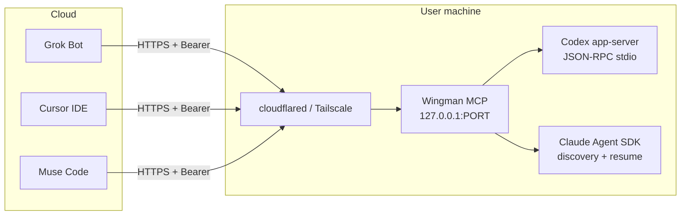

# Wingman

**Drive your local Codex and Claude Code sessions from any MCP client** — Cursor, Grok, Muse Code, another agent, or the assistant on your phone. Wingman is a small self-hosted MCP server that runs next to your coding agents so you can check on them, message them, and approve what they want to run, while the session stays on your machine.

[](https://github.com/juangurdian/wingman/actions/workflows/ci.yml)
[](https://www.npmjs.com/package/wingman-mcp)
[](LICENSE)
[](tsconfig.json)
[](https://nodejs.org/)

- **One endpoint, both agents** — Codex (app-server) and Claude Code (Agent SDK) behind the same [12 MCP tools](#mcp-tools).
- **Approvals from anywhere** — when an agent wants to run a command or edit files, the request waits in `list_approvals`. Nothing runs until a host calls `resolve_approval`.
- **Self-hosted** — binds to `127.0.0.1`, bearer-token auth, no account or cloud relay. You choose the tunnel.

See **[ROADMAP.md](ROADMAP.md)** for positioning, backlog, and non-goals.

---

## What people use it for

1. **Check in from anywhere** — start a refactor in Claude Code, then from another assistant ask "how's the auth refactor going?" (`wait_turn`, `read_transcript`) and approve the migration command it is waiting on (`list_approvals`, `resolve_approval`).
2. **Second opinion across agents** — have Claude Code review what Codex just did, or the reverse. Both run on your machine, so the reviewing agent connects to `127.0.0.1` with no tunnel.
3. **Agents on a dev box** — run Codex or Claude Code on a home server or VM and steer, interrupt, or export them from wherever you are.

Step-by-step setups live in [docs/recipes.md](docs/recipes.md). Using Wingman for something else? [Tell us in Discussions](https://github.com/juangurdian/wingman/discussions) — real setups shape the roadmap.

## Try it in 60 seconds

Mock mode needs no Codex or Claude install, so you can see the whole flow first:

```bash
CODEX_MOCK=1 CLAUDE_MOCK=1 npx wingman-mcp
```

It prints a bearer token and `http://127.0.0.1:3847/mcp`. Connect any MCP client that runs on the same machine, for example Claude Code:

```bash
claude mcp add --transport http wingman http://127.0.0.1:3847/mcp \
  --header "Authorization: Bearer <token printed by wingman>"
```

Then ask your client to `list_sessions`, or to `create_session` for Claude with the prompt `sudo apt update` — in mock mode that pauses on an approval you can inspect with `list_approvals` and answer with `resolve_approval`.

Drop the `*_MOCK` variables to use your real agents: Codex needs `codex` on `PATH`; Claude Code works through the bundled Agent SDK.

## Quickstart

### Option 1: npx (recommended)

```bash
# Run directly without install
npx wingman-mcp

# Or install globally for repeated use
npm install -g wingman-mcp
wingman-pair
```

### Option 2: Clone (for contributors)

```bash
git clone https://github.com/juangurdian/wingman.git
cd wingman
npm install
npm run pair
```

### After pairing

1. **Pair** — `wingman-pair` generates a bearer token, writes `~/.wingman/config.json`, and starts MCP on `127.0.0.1:3847/mcp`.
2. **Tunnel** — remote hosts cannot reach localhost. Pick a tunnel option (ranked by durability):

   ```bash
   # Option 1: Tailscale Serve (stable, loopback to your network)
   tailscale serve --bg 3847

   # Option 2: Tailscale Funnel (stable, public URL)
   tailscale funnel 3847

   # Option 3: Cloudflare named tunnel (stable, custom domain)
   # Run 'wingman-tunnel' for one-time setup instructions
   cloudflared tunnel run wingman

   # Option 4: Cloudflare quick tunnel (ephemeral, for demos)
   cloudflared tunnel --url http://127.0.0.1:3847
   ```

   For detailed setup help, run `wingman-tunnel` (or `npm run tunnel`).

3. **Add MCP server** (Grok Bot / Cursor `AddMcpServer`):

   | Field | Value |
   |-------|--------|
   | **name** | `wingman` |
   | **url** | `https://YOUR-TUNNEL-HOST/mcp` |
   | **Authorization** | `Bearer <token printed by pair>` |

Then ask the host to call `list_sessions` → `read_transcript` / `send_message` / `interrupt`.

### Host-specific guides

Different MCP hosts have different configuration methods. See the detailed guides:

| Host | Support | Guide |
|------|---------|-------|
| **Grok Bot** | ✅ Full | [docs/hosts/remote-hosts.md](docs/hosts/remote-hosts.md) |
| **Cursor IDE** | ✅ Full | [docs/hosts/cursor-ide.md](docs/hosts/cursor-ide.md) |
| **Muse Code** | ✅ Full | [docs/hosts/muse-code.md](docs/hosts/muse-code.md) |
| **Claude Desktop** | ⚠️ Limited | [docs/hosts/claude-desktop.md](docs/hosts/claude-desktop.md) |
| **Other clients** | Varies | [docs/hosts/generic-mcp-client.md](docs/hosts/generic-mcp-client.md) |

> **Note**: Wingman is a remote HTTP MCP server. Hosts that support HTTP + bearer auth work natively. Stdio-only hosts (like Claude Desktop) require a bridge — see the Claude Desktop guide for workarounds.

### Real provider modes

**Codex** — Requires `codex` on `PATH`. Wingman speaks **Codex app-server** JSON-RPC (`codex app-server` over stdio).

```bash
npm run pair   # unset CODEX_MOCK
```

**Claude Code** — Uses the `@anthropic-ai/claude-agent-sdk`. Sessions are created and resumed through the SDK. Tool calls that need permission (Bash, file edits, web fetches, MCP tools) pause as approvals until a host resolves them; see [Approvals](#approvals-codex--claude).

```bash
npm run pair   # unset CLAUDE_MOCK
```

**Muse** — experimental. Only mock mode (`MUSE_MOCK=1`) works today; the real provider is waiting on the Muse session API.

Docs: [Codex App Server](https://learn.chatgpt.com/docs/app-server) · [Claude Agent SDK](https://code.claude.com/docs/en/agent-sdk/typescript)

## Can / Can't

**Can**

- Pair in **mock mode** with no agent install (`CODEX_MOCK=1` or `CLAUDE_MOCK=1`)
- Bridge Grok Bot ↔ local Codex threads via app-server once tunneled
- Bridge Grok Bot ↔ local Claude Code sessions via Agent SDK once tunneled
- **Discover existing Claude sessions** via SDK's `listSessions()` (sessions you created via `claude` CLI or Claude Code IDE)
- Resume discovered sessions by ID — the SDK reads session state from `~/.claude/projects/`
- Send messages to sessions asynchronously (returns `accepted` quickly; turn runs in background)
- Approve or decline Codex and Claude tool calls remotely (`list_approvals` / `resolve_approval`)
- Check session status (idle vs running) via `get_session` or `list_sessions`
- Bearer-protect the MCP HTTP endpoint
- Create / list / read / message / interrupt sessions (real or mock) for both providers
- Keep you in the loop — the session stays visible on your machine

**Can't (scope / v1 limits)**

- Reach the bridge from a remote host without a **tunnel** (binds loopback only)
- **Type into an open TTY** — SDK resume ≠ injecting keystrokes into a Claude/Codex terminal you're watching; Wingman calls SDK APIs that operate on session state files, not terminal processes
- Hijack arbitrary Claude / Codex TTYs you already have open elsewhere — Wingman manages sessions via SDK, not by attaching to interactive shells
- Interrupt a discovered session reliably unless Wingman started the current turn (no active query handle)
- Auto-approve anything — every permission request waits for an explicit `resolve_approval`, unless you opt into a Claude permission mode such as `acceptEdits`
- Use legacy `codex mcp-server` (removed / not used here)

## Architecture


```mermaid
flowchart LR
  subgraph cloud [Cloud]
    Grok[Grok Bot]
    Cursor[Cursor IDE]
    Muse[Muse Code]
  end
  subgraph user [User machine]
    Tunnel[cloudflared / Tailscale]
    Bridge[Wingman MCP\n127.0.0.1:PORT]
    Codex[Codex app-server\nJSON-RPC stdio]
    Claude[Claude Agent SDK\ndiscovery + resume]
  end
  Grok -->|HTTPS + Bearer| Tunnel
  Cursor -->|HTTPS + Bearer| Tunnel
  Muse -->|HTTPS + Bearer| Tunnel
  Tunnel --> Bridge
  Bridge --> Codex
  Bridge --> Claude
```

## MCP tools

| Tool | Args | Notes |
|------|------|--------|
| `list_sessions` | `provider?`: `codex` \| `claude` | Lists sessions for one or both providers (includes `status`, `source`, `tags`, `hostId`, `hostName`) |
| `get_session` | `provider`, `session_id` | Get detailed session info including status (`idle` / `running`), tags, and host identity |
| `read_transcript` | `provider`, `session_id`, `limit?` | Recent messages (newest at end) |
| `send_message` | `provider`, `session_id`, `text` | Codex: `turn/start`; Claude: returns `accepted` quickly, turn runs async |
| `interrupt` | `provider`, `session_id` | Codex: `turn/interrupt`; Claude: works when Wingman owns the active turn |
| `create_session` | `provider`, `cwd?`, `prompt?`, `name?`, `tags?`, `model?` | Codex: `thread/start` with optional model override; Claude: new session with optional name/tags (async). Model defaults to Codex config/defaults when not specified. |
| `wait_turn` | `provider`, `session_id`, `timeout_ms?`, `poll_interval_ms?` | Wait for turn to complete/fail/timeout; returns status + message snippet (`inProgress` = blocked on approvals) |
| `steer` | `provider`, `session_id`, `text` | Add guidance to in-flight turn (Codex only; Claude returns unsupported) |
| `list_approvals` | `provider`, `session_id` | List pending approvals (Codex sandbox requests; Claude tool permission prompts) |
| `resolve_approval` | `provider`, `session_id`, `approval_id`, `decision` | `accept` \| `acceptForSession` \| `decline` \| `cancel` (cancel also stops the turn) |
| `set_session_meta` | `provider`, `session_id`, `name?`, `tags?` | Set session name/tags for easier discovery (Wingman-owned sessions) |
| `export_transcript` | `provider`, `session_id`, `format`, `limit?` | Export transcript as `markdown` \| `json`; returns content + writes to `~/.wingman/exports/` |

### create_session behavior

For **Claude sessions**, `create_session` returns immediately:
- **Without prompt**: Returns `{ sessionId, status: "created" }` — session is registered but no turn is running
- **With prompt**: Returns `{ sessionId, status: "accepted", turnId }` — the initial prompt turn runs in the background, preventing MCP HTTP timeouts

For **Codex sessions**, `create_session` calls `thread/start` and returns `{ sessionId, status: "created" | "accepted", model? }`.

### Codex model override

By default, Wingman does **not** override the Codex model — it uses whatever is configured in `~/.codex/config.toml` or Codex's built-in defaults. Override only when you intentionally need a different model for Wingman-created sessions:

**Via environment variable**:
```bash
export WINGMAN_CODEX_MODEL="your-preferred-model"
npx wingman-mcp
```

**Via create_session argument** (per-session):
```json
{ "provider": "codex", "model": "your-preferred-model", "prompt": "Hello" }
```

**Priority order**: `create_session.model` > `WINGMAN_CODEX_MODEL` env > user's `~/.codex/config.toml` > Codex defaults

**Note**: Some models may require API access rather than a ChatGPT subscription. If session creation fails due to model access, either ensure you have the required access level, or let Codex pick its default by not setting a model override. Run `wingman-doctor` to check for models that may require API access.

### send_message behavior

For **Claude sessions**, `send_message` returns immediately with `{ status: "accepted", turnId }` while the SDK query runs in the background. Use `get_session` or `read_transcript` to observe progress. This prevents MCP HTTP timeouts during long model turns.

For **Codex sessions**, `send_message` blocks until `turn/start` returns (typically fast), then returns `{ status: "completed" | "inProgress" }`.

### interrupt behavior

For **Claude sessions**, `interrupt` works reliably when Wingman owns the active turn (i.e., you called `send_message` through Wingman for the current turn). Returns `{ status: "interrupted", turnId }` on success, or `{ status: "no_active_turn" }` if the session is idle.

**Limitation**: Interrupting discovered sessions or sessions where the turn was started outside Wingman (e.g., via Claude CLI directly) may not work — Wingman has no active query handle to abort. In these cases, use the Claude CLI directly: `Ctrl+C` in the terminal or `claude interrupt`.

For **Codex sessions**, `interrupt` requires a known active `turnId` tracked from `turn/started` notifications.

### Session tags/names

Sessions can have human-friendly names and tags for easier discovery and filtering:

**create_session**: Pass `name` and/or `tags` when creating a session:
```
create_session({ provider: "claude", cwd: "/project", name: "Auth Refactor", tags: ["refactor", "auth"] })
```

**set_session_meta**: Update name/tags on existing Wingman-owned sessions:
```
set_session_meta({ provider: "claude", session_id: "sess_123", name: "Updated Name", tags: ["new", "tags"] })
```

Sessions returned by `list_sessions` and `get_session` include `name` and `tags` fields. For discovered Claude sessions, the legacy `tag` field is also converted to `tags`.

**Note**: In real mode, `set_session_meta` only works for Wingman-owned sessions (sessions created via Wingman's `create_session`). Codex real mode does not support custom metadata.

### wait_turn (both providers)

**wait_turn** provides long-poll waiting instead of busy-polling `read_transcript`. Works for both Codex and Claude sessions.

For **Claude sessions**, `wait_turn` polls until the turn completes, fails, is interrupted, times out, or blocks on approvals. This is essential for real Claude cold starts which can take 1-3+ minutes — use `wait_turn` to avoid MCP HTTP timeouts. If the turn already finished before you call `wait_turn`, it reports how that last turn ended (with `error` when it failed) instead of a bare `idle`.

Example Claude workflow:
```
1. create_session(prompt: "Build a web scraper")  →  { status: "accepted", turnId: "turn_1" }
2. wait_turn(timeout_ms: 180000)                  →  { status: "inProgress", pendingApprovals: 1 }
3. list_approvals() + resolve_approval(...)       →  { resolved: true }
4. wait_turn(timeout_ms: 180000)                  →  { status: "completed", latestMessage: "I've created..." }
```

For **Codex sessions**, `wait_turn` returns when the turn completes, fails, is interrupted, times out, or when approvals are pending.

Example response:
```json
{ "sessionId": "thr_123", "turnId": "turn_456", "status": "completed", "latestMessage": "Done!" }
```

### steer (Codex only)

**steer**: Add mid-turn guidance without starting a new turn. Uses Codex's `turn/steer` API.
- **Codex**: Useful for follow-up instructions while Codex is working.
- **Claude**: Returns `{ accepted: false, error: "Claude does not support mid-turn steering..." }`. Use `interrupt()` + `send_message()` instead.

### Approvals (Codex + Claude)

**list_approvals** + **resolve_approval**: a remote host sees what the agent wants to do and decides.
- **Codex**: sandbox commands, file changes, and network access, via app-server JSON-RPC requests.
- **Claude**: every tool call the Agent SDK would ask permission for (Bash, Edit/Write, WebFetch, MCP tools). Each approval includes `toolName` and the tool `input` (long values truncated).

Decisions:

| Decision | Effect |
|----------|--------|
| `accept` | Run this one call |
| `acceptForSession` | Run it and stop asking for similar calls this session (Claude: session-scoped rules only, never written to settings files) |
| `decline` | Skip this call; the agent continues and can try something else |
| `cancel` | Skip this call and stop the turn |

Approvals wait until resolved or until the turn is interrupted. For Claude you can reduce prompts with `CLAUDE_PERMISSION_MODE=acceptEdits` (file edits run without asking) or `auto`; `bypassPermissions` is not supported because Wingman is reachable over a tunnel.

Example approval flow (same shape for both providers):
```
1. send_message("sudo apt update")  →  { status: "inProgress" }
2. list_approvals()                 →  { approvals: [{ id: "appr_1", kind: "command", command: "sudo apt update" }] }
3. resolve_approval("appr_1", "accept")  →  { resolved: true }
4. wait_turn()                      →  { status: "completed" }
```

**Note**: In mock mode (`CODEX_MOCK=1` or `CLAUDE_MOCK=1`), messages containing `sudo` or `rm -rf` trigger simulated approval requests for testing.

## Environment variables

### General

| Variable | Default | Description |
|----------|---------|-------------|
| `WINGMAN_TOKEN` | (generated) | Bearer token for MCP auth |
| `WINGMAN_PORT` | `3847` | MCP server port |
| `WINGMAN_HOST` | `127.0.0.1` | MCP server bind address |
| `WINGMAN_WAIT_TURN_TIMEOUT_MS` | `60000` | Default timeout for `wait_turn` polling |
| `WINGMAN_WAIT_TURN_POLL_MS` | `500` | Default poll interval for `wait_turn` |
| `WINGMAN_HEALTHZ_AUTH_FREE` | `false` | Set to `1` to allow unauthenticated `/healthz` access |

### Codex

| Variable | Default | Description |
|----------|---------|-------------|
| `CODEX_MOCK` | unset | Set to `1` for in-memory mock mode |
| `CODEX_BIN` | `codex` | Path to Codex CLI binary |
| `CODEX_APP_SERVER_ARGS` | `app-server` | Args passed to Codex binary |
| `CODEX_RPC_TIMEOUT_MS` | `60000` | JSON-RPC timeout |
| `WINGMAN_CODEX_MODEL` | unset | Override Codex model for Wingman sessions (optional; defaults to Codex config/defaults) |

### Claude

| Variable | Default | Description |
|----------|---------|-------------|
| `CLAUDE_MOCK` | unset | Set to `1` for in-memory mock mode |
| `CLAUDE_DISCOVER` | `1` | Set to `0` to disable session discovery |
| `CLAUDE_DISCOVER_DIRS` | (all) | Colon-separated directories to search for sessions |
| `CLAUDE_PERMISSION_MODE` | `default` | Permission mode for Wingman-run turns: `default` (ask via approvals), `acceptEdits`, `plan`, `dontAsk`, `auto` |
| `CLAUDE_MAX_TURNS` | unset | Cap on agentic round-trips per turn (unset = no cap) |

The Claude provider uses the bundled Agent SDK binary automatically. No separate `claude` CLI install is required unless you override `pathToClaudeCodeExecutable` in code.

### Multi-Host

| Variable | Default | Description |
|----------|---------|-------------|
| `WINGMAN_HOST_ID` | hostname | Machine identifier for multi-host setups |
| `WINGMAN_HOST_NAME` | hostname | Human-friendly host name for display |

See [docs/hosts/multi-host.md](docs/hosts/multi-host.md) for running Wingman on multiple machines.

## Session management

### Wingman-managed sessions

Wingman tracks sessions it creates in a local registry (`~/.wingman/claude-sessions.json` for Claude). This ensures:

1. **Isolation** — Only sessions started through Wingman's `create_session` are visible to MCP clients by default
2. **No TTY hijack** — We don't scan for or attach to Claude/Codex processes you started elsewhere
3. **Resumable** — Sessions can be resumed by ID across Wingman restarts

### Claude session discovery

Wingman can also **discover existing Claude Code sessions** via the Agent SDK's `listSessions()`. This allows `list_sessions` to find sessions the user created via `claude` CLI or Claude Code IDE — not only sessions created through Wingman.

**How discovery works:**
1. `list_sessions` merges Wingman's registry with sessions discovered via SDK
2. If the same session ID exists in both, the Wingman registry entry takes precedence
3. `read_transcript`, `send_message`, and `interrupt` work for discovered sessions by resuming via `query({ options: { resume: sessionId } })`
4. When you interact with a discovered session, it's auto-registered in Wingman's registry

**What discovery is NOT:** This is not TTY hijacking. Wingman does not attach to terminal processes, scrape windows, or take over interactive sessions. Discovery reads session files on disk via official SDK APIs.

Set `CLAUDE_DISCOVER=0` to disable discovery and only show Wingman-created sessions.

### SessionSummary fields

Sessions returned by `list_sessions` include:

| Field | Type | Description |
|-------|------|-------------|
| `source` | `'wingman' \| 'discovered'` | Origin of the session |
| `name` | `string?` | Human-friendly session name |
| `tags` | `string[]?` | User-set tags for categorization/filtering |
| `gitBranch` | `string?` | Git branch at end of session (discovered) |
| `tag` | `string?` | Legacy single tag (discovered sessions only) |

### Claude session storage

Claude sessions are stored by the Agent SDK in `~/.claude/projects/<project-key>/<session-id>.jsonl`. Wingman's registry maps session IDs to their working directories so `listSessions()` and `readTranscript()` can locate them.

## Scripts & CLI

When installed globally (`npm i -g wingman-mcp`) or via npx:

| Command | Purpose |
|---------|---------|
| `wingman-pair` / `wingman-mcp` | Generate token, save config, start MCP, print pair instructions |
| `wingman-doctor` | Check environment: Node version, config, port, Claude SDK / Codex binary |
| `wingman-tunnel` | Detect tunnel tools, print ranked setup commands, persist tunnel state |

For local development:

| Script | Purpose |
|--------|---------|
| `npm run pair` | Same as `wingman-pair` (uses tsx) |
| `npm run doctor` | Same as `wingman-doctor` |
| `npm run tunnel` | Same as `wingman-tunnel` |
| `npm run dev` | Start MCP only (needs existing config/token) |
| `npm run build` | Compile TypeScript → `dist/` |
| `npm test` | Vitest unit tests (mocked providers) |

## Config

`~/.wingman/config.json` (new installs). If you still have a legacy `~/.session-bridge/config.json`, Wingman will read it as a fallback.

```json
{
  "token": "...",
  "host": "127.0.0.1",
  "port": 3847,
  "mcpPath": "/mcp",
  "createdAt": "...",
  "mock": true
}
```

## Health Endpoint

Wingman exposes a `/healthz` endpoint for monitoring and tunnel health checks.

**Default behavior**: Requires bearer authentication (same token as `/mcp`).

**Auth-free mode**: Set `WINGMAN_HEALTHZ_AUTH_FREE=1` to allow unauthenticated access to `/healthz`. This is useful for:
- Cloudflare Tunnel health checks
- Load balancer probes
- Uptime monitors that can't send auth headers

```bash
# Enable auth-free healthz (document the security tradeoff)
WINGMAN_HEALTHZ_AUTH_FREE=1 npm run pair
```

**Security tradeoff**: An auth-free `/healthz` reveals that Wingman is running but exposes no secrets, session data, or MCP functionality. The `/mcp` endpoint always requires bearer auth.

Example response:
```json
{ "ok": true, "service": "wingman" }
```

## Doctor / Health Check

Run `npm run doctor` (or `wingman-pair --doctor`) to verify your environment:

```bash
npm run doctor
```

Checks:
- Node.js version (20+ required)
- Config file (`~/.wingman/config.json`)
- Port availability (3847 by default)
- Claude Agent SDK availability (unless `CLAUDE_MOCK=1`)
- Codex binary on PATH (unless `CODEX_MOCK=1`)

The doctor prints clear next steps if any check fails.

## Agent skill

See [`skills/pair-coding-sessions/SKILL.md`](skills/pair-coding-sessions/SKILL.md) for setup / pair / operate steps aligned with this CLI.

## Security

See [SECURITY.md](SECURITY.md) for security policy, bearer token handling, and best practices.

## Community

Open source and early — Codex and Claude providers work (mock + real); APIs may shift before 1.0. See [CHANGELOG.md](CHANGELOG.md) for what changed.

- **Show your setup** — post how you use Wingman in [Discussions](https://github.com/juangurdian/wingman/discussions). Real use cases decide the roadmap.
- **Add an agent** — [docs/providers.md](docs/providers.md) walks through adding a provider.
- **First contribution?** Try an issue labelled [`good first issue`](https://github.com/juangurdian/wingman/labels/good%20first%20issue), or improve a [recipe](docs/recipes.md).

Issues and PRs welcome — see [CONTRIBUTING.md](CONTRIBUTING.md) and the [Code of Conduct](CODE_OF_CONDUCT.md). If Wingman helped you, star the repo so others can find it.

## Develop

```bash
git clone https://github.com/juangurdian/wingman.git
cd wingman
npm install
npm run doctor              # check environment
npm test                    # run tests
npm run build               # compile TypeScript
CODEX_MOCK=1 npm run pair   # or CLAUDE_MOCK=1
```

Node 20+. Success criteria: install, test, build succeed; mock pair prints URL + token.

## License

[MIT](LICENSE) © Juan Gurdian and contributors
